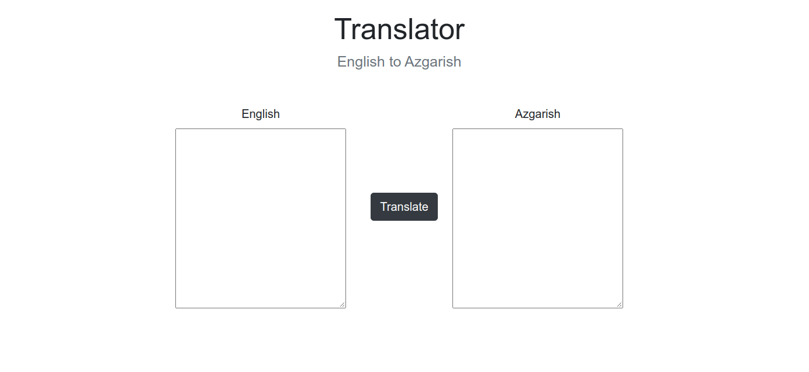

<!-- PROJECT LOGO -->

<h1 align="center">FreeCodeCamp Projects</h1>
 

  A single place to store all the projects I do on FreeCodeCamp.org

 

<!-- TABLE OF CONTENTS -->
# Table of Contents
* [About the Project](#about-the-project)
    * [Finished Project Link](#finished-project)
    * [Project Screenshot](#project-screenshot)
    * [Assignment](#assignment)
* [Contact](#contact)
* [Acknowledgements](#acknowledgements)

<!-- ABOUT THE PROJECT -->
# About The Project
An old project I did in Python, redone in Javascript. It's my interpretation of a Pig-Latin translator.

## Finished Project
Project Link: [https://br3ndan-l8n.github.io/MadeUp-Language-Converted/](https://br3ndan-l8n.github.io/MadeUp-Language-Converted/)

## Project Screenshot

<!-- CONTACT -->
# Contact
* [Email](BR3NDAN.L8N@gmail.com)
* [LinkedIn](https://www.linkedin.com/in/brendan-leighton-ab5944113/)

<!-- ACKNOWLEDGEMENTS -->
# Acknowledgements
* [GitHub Pages](https://pages.github.com)
* [w3schools](https://www.w3schools.com/)
* [Developer.Mozilla.org](https://developer.mozilla.org/en-US/docs/Web/)
